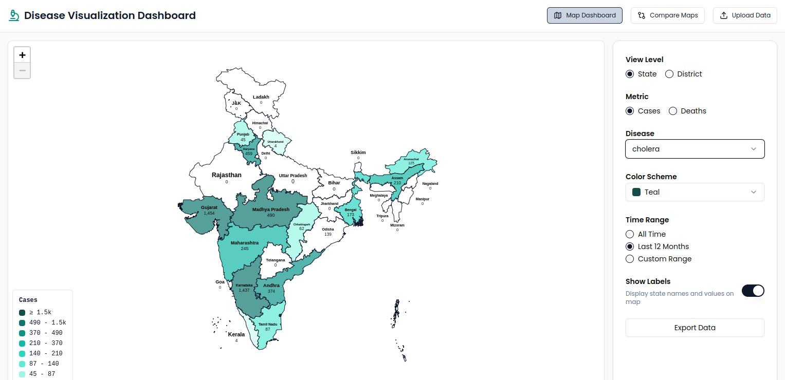

# Disease Visualization Dashboard

A comprehensive web application for visualizing disease data across India, built with Next.js, Prisma, and Leaflet.



## Features

### Map Visualization

- Interactive state and district level maps
- Multiple color schemes:
  - Single-color gradients (Teal, Blue, Red)
  - Scientific palettes (Viridis, Plasma, Inferno)
  - Diverging schemes (Spectral, Coolwarm)
- Dynamic legend with quantile-based ranges
- Hover tooltips with detailed information
- State labels option for exports

### Data Analysis

- Temporal trend analysis with charts
- Multiple comparison views
- Customizable date ranges
- Case and death statistics
- District-wise breakdowns

### Export Options

- High-resolution PNG export
- Vector SVG export
- Comprehensive PDF reports
- Comparison view exports

## Technology Stack

### Frontend

- **Framework**: Next.js 15 with App Router
- **Language**: TypeScript
- **State Management**: Zustand with persistence
- **Styling**: Tailwind CSS
- **Components**: Radix UI primitives
- **Maps**: Leaflet with React bindings
- **Charts**: Recharts

### Backend

- **Database**: SQLite with Prisma ORM
- **API**: Next.js API routes
- **Export**: Puppeteer for image generation
- **PDF Generation**: jsPDF

## Project Structure

```
/
├── app/                    # Next.js app router
│   ├── api/               # API routes
│   ├── (routes)/          # Page routes
│   └── layout.tsx         # Root layout
├── components/
│   ├── charts/           # Chart components
│   ├── maps/             # Map components
│   ├── layout/           # Layout components
│   ├── ui/               # UI components
│   ├── features/         # Feature components
│   └── shared/           # Shared components
├── lib/
│   ├── api/             # API client functions
│   ├── constants/       # Constants and configs
│   ├── utils/          # Utility functions
│   └── store.ts        # Global state
├── prisma/              # Database schema
├── public/             # Static assets
└── styles/             # Global styles
```

## Getting Started

### Prerequisites

- Node.js 18+
- pnpm (recommended) or npm
- SQLite

### Development Setup

1. Clone the repository:

   ```bash
   git clone https://github.com/your-username/disease-dashboard.git
   cd disease-dashboard
   ```

2. Install dependencies:

   Using pnpm:

   ```bash
   pnpm install
   ```

   Using npm:

   ```bash
   npm install
   ```

3. Set up environment variables:

   Copy the example environment file and configure it as needed:

   ```bash
   cp .env.example .env
   ```

   - Ensure you set the `NEXT_PUBLIC_APP_URL` to your application's URL if deploying.
   - Adjust database connection settings if necessary.

4. Set up the database:

   Using pnpm:

   ```bash
   pnpm db:push
   ```

   Using npm:

   ```bash
   npx prisma db push
   ```

5. Generate the Prisma client:

   Using pnpm:

   ```bash
   pnpm prisma generate
   ```

   Using npm:

   ```bash
   npx prisma generate
   ```

6. Start the development server:

   Using pnpm:

   ```bash
   pnpm dev
   ```

   Using npm:

   ```bash
   npm run dev
   ```

### Deployment

To build and start the application for production:

Using pnpm:

```bash
pnpm build
pnpm start
```

### Using Your Own Data

#### Generating Random Data

To generate random data, use the provided script:

Using pnpm:

```bash
pnpm ts-node scripts/generate-random-data.ts
```

Using npm:

```bash
npx ts-node scripts/generate-random-data.ts
```

#### Using CSV to Update

1. Prepare your data in CSV format.
2. Use the import script to update the database:

   Using pnpm:

   ```bash
   pnpm import:geo
   ```

   Using npm:

   ```bash
   npx import:geo
   ```

3. Ensure your data matches the schema defined in `prisma/schema.prisma`.

## Configuration

### Color Schemes

Color schemes are defined in `lib/constants/color-schemes.ts`:

- Single-color gradients for simple visualizations
- Scientific palettes for accurate data representation
- Diverging schemes for comparative analysis

### Map Settings

Customize map settings in `components/maps/`:

- Zoom levels
- Center coordinates
- Interaction controls
- Style configurations

## License

This project is licensed under the MIT License - see the [LICENSE](LICENSE) file for details.

## Acknowledgments

- KCDH IITB for project support
- [Leaflet](https://leafletjs.com/) for mapping functionality
- [Recharts](https://recharts.org/) for charting
- [Radix UI](https://www.radix-ui.com/) for accessible components
